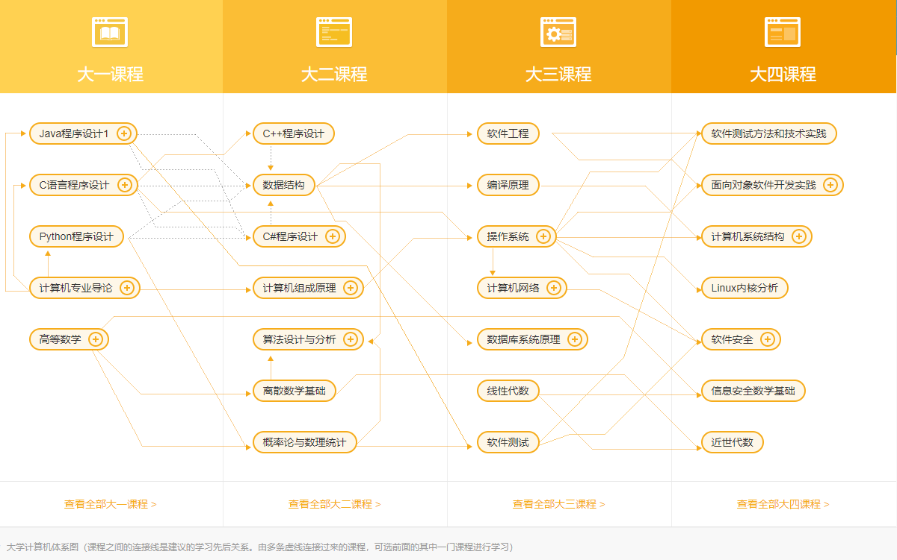

# 顶尖中文大学计算机专业课程体系
**汇集全国多家知名大学里广受学生好评的计算机老师，每一门课程都由他们亲自制作，权威、专业！ 人人都可以在这里体验到时下最流行的 MOOC，系统地掌握计算机专业知识。**
> MOOC是Massive Open Online Course的缩写，被译为大型开放式网络课程。这是一种在线教育形式，任何人都能免费注册使用，它有与线下课程类似的作业评估体系和考核方式。按时完成作业和考试的学习者还可能收获导师签署的证书。
## 大学计算机体系图

## 项目目录

- ### 大一课程

    #### 程序设计入门-Python

- ### 大二课程
    #### 计算机组成原理
    
    #### 算法设计与分析

- ### 大三课程

- ### 大四课程

> 网易云课堂-大学计算机专业：https://study.163.com/curricula/cs.htm
